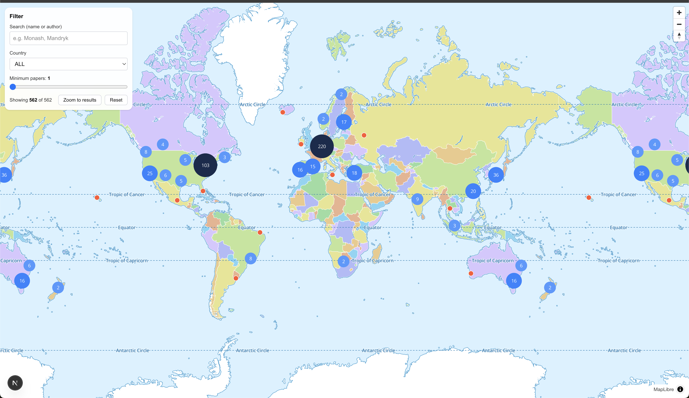

# Game Leadership Map

> A global interactive map visualising academic and industry institutions conducting games research — powered by publication data from **CHI PLAY** and **OpenAlex**.

---

## Table of Contents

1. [Overview](#-overview)
2. [Screenshot](#-screenshot)
3. [Key Features](#-key-features)
4. [Quick Start](#-quick-start)
5. [Technology Stack](#-technology-stack)
6. [Data Sources](#-data-sources)
7. [Data Structure](#-data-structure)
8. [Features in Detail](#-features-in-detail)
9. [Project Structure](#-project-structure)
10. [Development](#-development)
11. [Database Workflow](#-database-workflow)
12. [Data Refresh Workflow](#-data-refresh-workflow-contributors--maintainers)
13. [Automating Refreshes](#-automating-refreshes)
14. [Deployment](#-deployment)
15. [Contributing](#-contributing)
16. [Future Enhancements](#-future-enhancements)
17. [License](#-license)
18. [Acknowledgements](#-acknowledgements)
19. [Support](#-support)

---

## 🌍 Overview

The **Game Leadership Map** reveals the international landscape of games research. It surfaces where research happens, who contributes, and how institutions collaborate through shared publications. Data from **DBLP**, **OpenAlex**, and **ROR** is enriched and rendered via an interactive **MapLibre** interface backed by a **Prisma + SQLite** datastore.

---

## 📸 Screenshot

  
*Interactive map showing games research institutions worldwide with clustering and filtering capabilities.*

---

## ✨ Key Features

- **Interactive World Map** – Smooth zooming, panning, and clustering powered by MapLibre GL  
- **Research Data Visualisation** – Displays institutions, paper counts, and top authors  
- **Advanced Filtering** – Search by name, country, and paper count  
- **Smart Clustering** – Automatic grouping with interactive expansion  
- **Responsive Design** – Works seamlessly on desktop and mobile  
- **Real-time Search** – Instant filtering by text or author name  

---

## 🚀 Quick Start

### Prerequisites

- Node.js **v18+**
- npm, yarn, pnpm, or bun

### Installation

1. Clone the repository:
   ```bash
   git clone <repository-url>
   cd game-leadership-map
   ```

**Install dependencies:**
```bash
 
npm install
# or
yarn install
```

**Create a .env file (if it doesn’t exist) and set the database path:**
```bash

DATABASE_URL="file:./prisma/dev.db"
```

**Apply the database schema:**
```bash
 
npx prisma migrate deploy
```

**Seed the database with CHI PLAY papers, institutions, and authors:**
```bash
 
npm run db:seed
```

**Start the development server:**
```bash
 
npm run dev
```

Open http://localhost:3000 in your browser.

### Environment targets

- Local development uses SQLite by default (`prisma/schema.prisma`). No extra configuration is required—just keep `DATABASE_URL="file:./prisma/dev.db"` in `.env`.
- To target Postgres (e.g., Neon in production), copy `prisma/schema.postgres.prisma` and set the environment variable `PRISMA_SCHEMA_PATH=prisma/schema.postgres.prisma` before running Prisma commands. Example:
  ```bash
  PRISMA_SCHEMA_PATH=prisma/schema.postgres.prisma npx prisma migrate deploy
  PRISMA_SCHEMA_PATH=prisma/schema.postgres.prisma npx prisma generate
  ```
- On deployment platforms such as Vercel, set both `DATABASE_URL` (to your Neon connection string) and `PRISMA_SCHEMA_PATH` as project environment variables so the build and runtime use the Postgres schema.
- Use `.env.production.example` as a template for production secrets when configuring remote environments.

## 🛠️ Technology Stack

- Framework: Next.js 15.5.4 (App Router)
- Frontend: React 19.1 + TypeScript 5
- Mapping: MapLibre GL JS
- Styling: Tailwind CSS 4
- Database: SQLite via Prisma ORM
- Build Tool: Turbopack for fast incremental builds

## 📊 Data Sources

- Raw source files live under data/ (ignored in Git by default):
- chiplay_institutions_geo.json – Institution IDs with location metadata
- chiplay_papers_with_doi.json – CHI PLAY papers enriched with DOIs
- openalex_authorships.jsonl – OpenAlex authorship data linking authors and institutions
- Running npm run db:seed parses these files and upserts records into the database.

## 📊 Data Structure

- The frontend consumes marker data from /api/markers.
- That API route queries the SQLite database (via Prisma) for institutions, paper counts, and top authors, returning map-ready JSON.

**Marker API payload**

```typescript
 
type Marker = {
  id: string;
  name: string;
  country?: string;
  lat: number;
  lng: number;
  paper_count: number;
  top_authors?: string[];
};
```

**Sample API response**

```json
 
{
  "id": "inst:ror:01aff2v68",
  "name": "University of Waterloo",
  "country": "CA",
  "lat": 43.4668,
  "lng": -80.51639,
  "paper_count": 49,
  "top_authors": [
    "Lennart E. Nacke",
    "Gustavo F. Tondello",
    "Mark Hancock",
    "Rina R. Wehbe",
    "John Harris"
  ]
}
```

**Database Tables**  
Defined in prisma/schema.prisma:

- Paper – CHI PLAY publications with DOI/OpenAlex IDs
- Author – Unique researchers
- Institution – Research organisations with geo metadata
- Authorship – Links authors, institutions, and papers

## 🎯 Features in Detail

**Interactive Map**

- Base map via MapLibre demo style
- Clustering with adaptive circle size and colour
- Zoom controls in top-right corner
- Smooth animation and responsive behaviour

**Filtering System**

- Search by institution or author name
- Country dropdown filter
- Slider for minimum paper count
- Reset and zoom-to-results buttons

**Data Visualisation**

- Blue clusters for grouped institutions
- Red markers for individual points
- Popup overlays showing:
  - Institution name and country
  - Paper count
  - Top researchers

**User Experience**

- Auto-zoom on filter change or single result
- 700 ms map transition easing
- Graceful error handling

## 📁 Project Structure

```graphql
 
game-leadership-map/
├── data/                          # Raw CHI PLAY + OpenAlex datasets for seeding
│   ├── chiplay_institutions_geo.json
│   ├── chiplay_papers_with_doi.json
│   └── openalex_authorships.jsonl
├── prisma/
│   ├── migrations/
│   ├── dev.db                     # SQLite database
│   ├── schema.prisma              # Prisma models
│   └── seed.js                    # ETL script for seeding
├── public/                        # Static assets (logos, screenshot, etc.)
├── src/
│   └── app/
│       ├── api/markers/route.ts   # Marker API route
│       ├── globals.css
│       ├── layout.tsx
│       └── page.tsx               # Main map component
├── package.json
├── next.config.ts
├── tsconfig.json
└── README.md
```

## 🔧 Development

**Available Scripts**

- npm run dev – Start dev server
- npm run build – Production build
- npm run start – Run built app
- npm run db:seed – Refresh the database with new data

## 🧱 Database Workflow

- Migrations – Run npx prisma migrate deploy or npx prisma migrate reset
- Seeding – Run npm run db:seed to rebuild the DB from files in /data/
- Inspection – Run npx prisma studio to browse and validate data visually

## 🔁 Data Refresh Workflow (Contributors & Maintainers)

This workflow explains how to update the data used by the Game Leadership Map when new research (e.g., CHI PLAY 2025 papers) becomes available. All data files live inside the top-level `data/` directory and are loaded into the database through Prisma.

### 📂 Directory Overview

```bash
data/
├── chiplay_institutions_geo.json     # Institution names, countries, and coordinates
├── chiplay_papers_with_doi.json      # CHI PLAY paper metadata with DOIs
└── openalex_authorships.jsonl        # Author–paper–institution relationships
```

### 🧠 Understanding Each File

#### 1. chiplay_institutions_geo.json

- Purpose: Lists all institutions on the map.
- Used for: Marker placement and country filters.
- Format:
  ```json
  [
    {
      "id": "inst:ror:01aff2v68",
      "name": "University of Waterloo",
      "country": "CA",
      "lat": 43.4668,
      "lng": -80.51639
    }
  ]
  ```
- Update steps:
  - Add new institutions from CHI PLAY proceedings.
  - Verify IDs on ror.org.
  - Add coordinates from OpenStreetMap or Google Maps.

#### 2. chiplay_papers_with_doi.json

- Purpose: Stores CHI PLAY paper metadata.
- Used for: Linking authorships and counting papers.
- Format:
  ```json
  [
    {
      "dblpKey": "conf/chiplay/Smith2025",
      "title": "Designing Playful Health Technologies",
      "year": 2025,
      "venue": "CHI PLAY 2025",
      "doi": "10.1145/1234567.1234568",
      "openalexId": "W123456789",
      "authorships": [
        { "author_name": "Jane Smith", "institution_id": "inst:ror:01aff2v68", "author_order": 1 }
      ]
    }
  ]
  ```
- Update steps:
  - Get latest data from DBLP.
  - Add new entries for the latest year.
  - Add DOIs (from ACM Digital Library).
  - Include openalexId if available.

#### 3. openalex_authorships.jsonl

- Purpose: Defines author–paper–institution relationships.
- Used for: Counting top authors per institution.
- Format:
  ```json
  {"author": "Jane Smith", "paper_doi": "10.1145/1234567.1234568", "institution_id": "inst:ror:01aff2v68", "order": 1}
  {"author": "John Doe", "paper_doi": "10.1145/2345678.2345679", "institution_id": "inst:ror:03y9q1t90", "order": 2}
  ```
- Update steps:
  - Add or update entries for new papers.
  - Ensure all DOIs match those in `chiplay_papers_with_doi.json`.
  - Keep `order` numeric (e.g., 1, 2).

### ⚙️ Seeding the Database

```bash
npm run db:seed
```

This reads data from `data/`, inserts it into `prisma/dev.db`, and rebuilds all relationships automatically.

### 🔍 Verify in Prisma Studio

```bash
npx prisma studio
```

- Check institution coordinates
- Verify paper counts
- Confirm author–institution links

### 🔄 Restart the App

```bash
npm run dev
```

Visit <http://localhost:3000> to confirm updates.

### 💡 Common Checks

| Issue | Fix |
|-------|-----|
| Institution not visible | Add valid lat/lng |
| Duplicates | Merge by ROR ID |
| Paper missing DOI | Still loads, but won’t link to OpenAlex |
| JSON syntax errors | Validate via jsonlint.com |
| Author order invalid | Must be a number |

### ✅ Final Checklist

- JSON and JSONL files validate correctly
- ROR IDs are unique
- DOIs match between files
- Prisma Studio shows expected counts
- Map updates correctly

### TL;DR Summary

```bash
# Edit files in /data
npm run db:seed
npx prisma studio
npm run dev
```

## 🧰 Automating Refreshes

To make it easier for contributors and maintainers to update the local SQLite database with new data files, the project includes a ready-to-use automation script.

### 1. Manual refresh (recommended for local development)

You can refresh your database anytime with a single command:

```bash
npm run refresh
```

This command runs the script `scripts/refresh_data.sh`, which:

- Validates that the required data files exist in `/data`
  (`chiplay_institutions_geo.json`, `chiplay_papers_with_doi.json`, and `openalex_authorships.jsonl`)
- Backs up your existing SQLite database (`prisma/dev.db`) to `/backups`
- Applies any pending Prisma migrations
- Seeds the database with the latest CHI PLAY and OpenAlex data using `npm run db:seed`
- Logs the entire process with timestamps in `/logs`
- Verifies that the number of institutions, authors, and papers imported looks correct (if `sqlite3` is installed)

This process is idempotent, meaning it’s safe to rerun — each seed operation upserts existing records instead of duplicating them.

### 2. What happens behind the scenes

The script performs the following sequence:

1. Create or reuse `/logs` and `/backups` directories
2. Lock the process to prevent parallel runs
3. (Optional) Pull latest changes from git if configured
4. Install dependencies (`npm ci`)
5. Backup current `dev.db`
6. Validate data files in `/data`
7. Run Prisma migrations
8. Run seeding (`npm run db:seed`)
9. Log record counts
10. (Optional) Build or reload the app
11. Unlock and exit cleanly

All actions and errors are logged to `logs/refresh_YYYYMMDD_HHMMSS.log` for traceability.

### 3. Optional automation for servers

If you’re deploying this project on a server and want the data to stay current automatically, you can schedule the refresh script with cron.

Example (runs nightly at 02:30):

```cron
30 2 * * * /bin/bash /ABSOLUTE/PATH/TO/scripts/refresh_data.sh >> /ABSOLUTE/PATH/TO/logs/cron.log 2>&1
```

This setup:

- Keeps the database in sync without manual intervention
- Automatically backs up old database versions
- Writes every run’s output to a single rolling log

You can also enable optional flags inside the script:

- `GIT_PULL=1` to fetch latest commits before seeding
- `DO_BUILD=1` to rebuild the app after seeding
- `PM2_APP_NAME="game-leadership-map"` to reload a running Node app after seeding

### 4. When to use automation

| Situation              | Recommended Action                                           |
|------------------------|--------------------------------------------------------------|
| Local development      | Use `npm run refresh` manually                               |
| Team/shared environment| Schedule cron job                                            |
| Production server      | Enable `GIT_PULL`, `DO_BUILD`, and `PM2_APP_NAME` in cron or environment |
| Data-only updates      | Copy new files into `/data` and rerun the script             |

In short:  
For contributors, just update the JSON/JSONL files in `/data` and run:

```bash
npm run refresh
```

For maintainers or production servers, automate the same script using cron for nightly refreshes.

## 🚀 Deployment

**Vercel (Recommended)**

- Push your code to GitHub.
- Connect to Vercel.
- Deploy automatically — no config required.
- Need the full walkthrough (including Neon/Postgres setup)? See [DEPLOYMENT.md](DEPLOYMENT.md) for step-by-step instructions.

Other supported platforms: Netlify, Railway, AWS Amplify, DigitalOcean.

## 🤝 Contributing

- Fork the repo
- Create a feature branch
- Commit, push, and open a Pull Request

**Guidelines:**

- Use TypeScript
- Follow existing code style
- Test responsiveness and accessibility

## 📈 Future Enhancements

- Research timeline visualisation
- Analytics dashboard
- Institution comparison tools
- Dark mode
- Automatic dataset updates

## 📄 License

Open source under the MIT License.

## 🙏 Acknowledgements

- Built with Next.js and MapLibre GL
- Data sourced from CHI PLAY and OpenAlex

---
Inspired by the global games research community

## 📞 Support

- Open an issue on GitHub
- Contact the maintainers
- Check the documentation

**Made with ❤️ for the Games Research Community**  
Visualising the people and places shaping play around the world.
